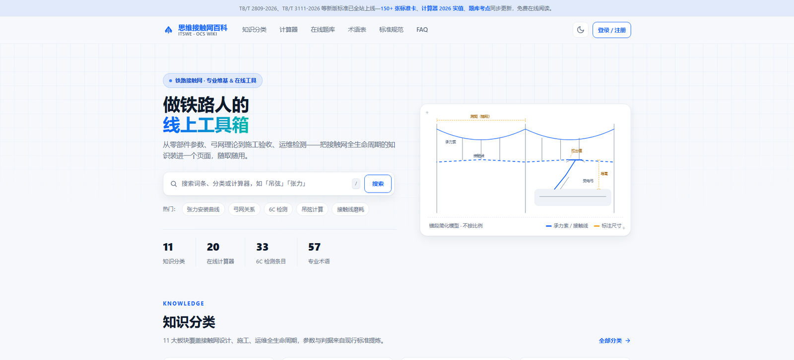

# 思维接触网百科 · 铁路接触网（OCS）计算工具集

**铁路接触网（Overhead Contact System）工程计算工具 —— 20 个计算器，公式公开、零运行时依赖、纯函数 TypeScript，可直接在你的项目里引用。已对齐 TB/T 2809-2026《电气化铁路接触网 铜合金接触线》。**

覆盖张力-温度安装曲线、吊弦长度、弛度、风偏限界、载流量与短路热稳定、接触线磨耗、锚段长度校核等接触网设计、施工与维护中的高频计算。

**20 个模块 · 228 项单元测试 · 零运行时依赖 · 纯函数 TypeScript**（Node ≥ 18）

🔗 在线使用：[https://www.itswe.com/Category:tools](https://www.itswe.com/Category:tools)
📖 配套百科：[https://www.itswe.com](https://www.itswe.com)（670+ 页接触网专业内容）

[English](./README_EN.md) | 简体中文


[](https://github.com/showhoo/ocs-calculators/actions/workflows/ci.yml)




---

## 目录

- [为什么用它](#为什么用它)
- [安装](#安装)
- [快速开始](#快速开始)
- [20 个计算器（全部实现）](#20-个计算器全部实现)
- [新标准对齐：TB/T 2809-2026](#新标准对齐-2809-2026)
- [单位约定](#单位约定)
- [每个模块都带 meta](#每个模块都带-meta)
- [与站点实现的同步政策](#与站点实现的同步政策)
- [免责声明](#免责声明)
- [新增一个计算器](#新增一个计算器)
- [相关项目](#相关项目)

## 为什么用它

- **公式公开可查** — 每个模块的 `meta.ts` 里写明公式、参考依据与适用范围，不是黑盒
- **有单元测试** — 计算结果的期望值直接取自站点已发布的输出表，可复现、可校验（228 项全绿）
- **零运行时依赖** — 全部是纯函数，浏览器和 Node 通用，不会给你的项目塞进一堆传递依赖
- **单位写在变量名里** — `tensionKN`、`spanM`、`crossSectionMM2`，杜绝工程计算里最常见的单位错误
- **对新版标准友好** — 已按 **TB/T 2809-2026**（2026-09-01 实施）刷新线材参数、载流量与电阻温度系数口径，新旧对照可查

## 安装

```bash
npm install ocs-calculators
```

要求 Node ≥ 18。裸安装即取最新版（当前 `0.3.2`，已对齐 TB/T 2809-2026）。完整版本历史见 [CHANGELOG.md](./CHANGELOG.md)。

## 快速开始

```ts
import { tensionCurve } from 'ocs-calculators';

// 张力-温度安装曲线：CTMH-120，当量跨距 55 m，基准 20 kN @ -20 ℃
const curve = tensionCurve(
  {
    baseTensionKN: 20,
    baseTempDegC: -20,
    weightPerLengthNPerM: 10.56,   // CTMH-120 自重，TB/T 2809-2026 表3 参考单位质量 1076 kg/km → 1.076 × 9.81
    spanM: 55,
    elasticModulusGPa: 120,
    crossSectionMM2: 120,
    expansionPerDegC: 1.7e-5,
  },
  [-20, -10, 0, 10, 20, 30, 40],
);

for (const p of curve) {
  console.log(`${p.targetTempDegC}℃  T=${p.tensionKN.toFixed(2)} kN  f=${p.sagM.toFixed(3)} m`);
}
// -20℃  T=20.00 kN  f=0.200 m
// -10℃  T=17.69 kN  f=0.226 m
//   0℃  T=15.45 kN  f=0.259 m
//  10℃  T=13.30 kN  f=0.300 m
//  20℃  T=11.29 kN  f=0.354 m
//  30℃  T= 9.50 kN  f=0.420 m
//  40℃  T= 7.98 kN  f=0.500 m
```

上面这段输出与 <https://www.itswe.com/calculator/tension/> 在线计算器完全一致，测试用例里做了逐行回归。

也支持按模块子路径导入（利于打包工具做 tree-shaking）：

```ts
import { windClearanceCheck } from 'ocs-calculators/wind';
import { wearRatio } from 'ocs-calculators/wear';
import { steadyArmAngleDeg } from 'ocs-calculators/steady-arm';
import { crossSpanAnalyze } from 'ocs-calculators/cross-span';
import { bValue } from 'ocs-calculators/bvalue';
import { sagMM } from 'ocs-calculators/sag';
import { anchorLengthCheck } from 'ocs-calculators/anchor-length';
import { creepageCheck } from 'ocs-calculators/creepage';
import { poleCapacityCheck } from 'ocs-calculators/pole-capacity';
import { cantileverCut } from 'ocs-calculators/cantilever';
```

## 20 个计算器（全部实现）

对应 <https://www.itswe.com/Category:tools> 的 20 个在线计算器，全部已实现并逐项回归。

| 计算器 | 模块 | 计算内容 | 在线地址 |
|---|---|---|---|
| 张力-温度安装曲线 | `tension` | 状态方程求任意温度下的张力与弛度 | [/calculator/tension/](https://www.itswe.com/calculator/tension/) |
| 弓网接触力评价 | `force` | EN 50367 统计评价 F'max/F'min 与参考目标力 | [/calculator/force/](https://www.itswe.com/calculator/force/) |
| 载流量与热稳定 | `ampacity` | 环境温度载流量修正与短路热稳定最小截面 | [/calculator/ampacity/](https://www.itswe.com/calculator/ampacity/) |
| 吊弦长度计算 | `dropper` | 简单/弹性链形悬挂逐点吊弦长度 | [/calculator/dropper/](https://www.itswe.com/calculator/dropper/) |
| 风偏限界校验 | `wind` | 跨中风偏移与限界判据 | [/calculator/wind/](https://www.itswe.com/calculator/wind/) |
| 接触线磨耗率 | `wear` | 按残截面/残径求磨耗率与更换判定 | [/calculator/wear/](https://www.itswe.com/calculator/wear/) |
| 接触线参数速查 | `copper` | 6 型号单位重/电阻/载流量速查 | [/calculator/copper/](https://www.itswe.com/calculator/copper/) |
| 补偿行程 | `stroke` | 温度伸缩量与补偿行程（1:2~1:4 传动比） | [/calculator/stroke/](https://www.itswe.com/calculator/stroke/) |
| 波速利用率 | `wavespeed` | 波速、利用率 β 与共振车速 | [/calculator/wavespeed/](https://www.itswe.com/calculator/wavespeed/) |
| 电压降校核 | `voltage-drop` | 馈线压降与末端电压 | [/calculator/voltage-drop/](https://www.itswe.com/calculator/voltage-drop/) |
| 曲线拉出值校核 | `curve-stagger` | 曲线处拉出值与风偏合成 | [/calculator/curve-stagger/](https://www.itswe.com/calculator/curve-stagger/) |
| 覆冰荷载校核 | `icing` | 冰筒模型覆冰荷载与弛度增幅 | [/calculator/icing/](https://www.itswe.com/calculator/icing/) |
| 弛度速算 | `sag` | 由张力/跨距/单位重速算弛度，或反求最大跨距 | [/calculator/sag/](https://www.itswe.com/calculator/sag/) |
| b 值（坠砣高度）安装曲线 | `bvalue` | 坠砣高度随温度变化曲线与 b_min 校核 | [/calculator/bvalue/](https://www.itswe.com/calculator/bvalue/) |
| 绝缘子爬电距离选型校核 | `creepage` | 污区爬电比距 → 所需爬电距离判定 | [/calculator/creepage/](https://www.itswe.com/calculator/creepage/) |
| 锚段长度张力差校核 | `anchor-length` | 曲线/直线支张力差与锚段长度判据 | [/calculator/anchor-length/](https://www.itswe.com/calculator/anchor-length/) |
| 定位器坡度校核 | `steady-arm` | 定位器坡度多分量合成与限值判定 | [/calculator/steady-arm/](https://www.itswe.com/calculator/steady-arm/) |
| 软横跨负载计算 | `cross-span` | 软横跨负载分力与横向承力索张力 | [/calculator/cross-span/](https://www.itswe.com/calculator/cross-span/) |
| 支柱容量选型校核 | `pole-capacity` | 支柱检验弯矩与容量选型 | [/calculator/pole-capacity/](https://www.itswe.com/calculator/pole-capacity/) |
| 腕臂预配（勾股下料） | `cantilever` | 腕臂各段下料长度与安装裕度 | [/calculator/cantilever/](https://www.itswe.com/calculator/cantilever/) |

原 12 个模块的公式与默认参数取自站点 `/calculator/assets/calc-core.js` 源码；
新增的 8 个模块（sag/bvalue/creepage/anchor-length/steady-arm/cross-span/pole-capacity/cantilever）为站点**内联引擎计算器**（引擎直嵌页面 HTML，不经 calc-core），本仓库按其 online 页面公式提炼，单元测试期望值由公式独立算出，未从服务器渲染结果反推。

## 新标准对齐：TB/T 2809-2026

本库已按 **TB/T 2809-2026《电气化铁路接触网 铜合金接触线》**（2026-09-01 实施）刷新数据与计算口径，与站点 [itswe.com](https://www.itswe.com) 全量一致：

- **接触线单位重量**：按 2026 表3 参考单位质量取 `CTMH-120/150 = 1076/1342 kg/km`、`CTAH-120 = 1076 kg/km`（自重 `g ≈ 10.56 N/m`）
- **室内载流量双口径**：`TB2809_WIRE_PARAMS` 主值切 2026 表5（如 CTMH-120 150℃ 室内 `442 A`），并保留 `ampacityIndoor150A2017` 同点位对照字段，便于既有线历史采购参照
- **电阻温度系数 per-alloy 实装**：CTMH `0.00270` / CTAH `0.00380` / CTS `0.00320`（按材质真值 α，取代纯铜近似）
- **r₂₀ 错档更正**：CTMH-120 `0.2211`、CTMH-150 `0.1769`、CTS-120 `0.1545`、CTS-150 `0.1236`（各材质 20℃ 电阻率上限 ÷ 标称截面）

线材参数取值均可在 `src/data/wire-specs.ts`、`src/data/tb2809-ampacity.ts` 中逐项核对，标准号与年份随每次修订同步更新。

## 单位约定

| 量的后缀 | 单位 | 例 |
|---|---|---|
| `...KN` | kN | `baseTensionKN`, `tensionKN` |
| `...N` | N | `residualN`, `tensionN` |
| `...NPerM` | N/m | `weightPerLengthNPerM` |
| `...M` | m | `spanM`, `sagM` |
| `...MM` / `...MM2` | mm / mm² | `wireDiameterMM`, `crossSectionMM2` |
| `...GPa` | GPa | `elasticModulusGPa` |
| `...PerDegC` | 1/℃ | `expansionPerDegC` |
| `...DegC` | ℃ | `baseTempDegC` |
| `...KgPerM` / `...KgPerM3` | kg/m / kg/m³ | `linearMassKgPerM` |

## 每个模块都带 meta

```ts
import { tensionMeta } from 'ocs-calculators';

console.log(tensionMeta.formula);     // 状态方程、弛度、当量跨距、覆冰公式
console.log(tensionMeta.references);  // 依据标准号，以及"该标准是否真的包含此公式"
console.log(tensionMeta.scope);       // 适用范围：跨距 20~90 m、E 50~200 GPa …
console.log(tensionMeta.disclaimer);  // 免责声明
```

## 与站点实现的同步政策

本仓库是 [itswe.com](https://www.itswe.com) 在线计算器的公式算法层，同步基准为站点资产：

- 原 12 个模块以 [`calculator/assets/calc-core.js`](https://www.itswe.com/calculator/assets/calc-core.js) 为准；
- 新增 8 个模块（`sag`/`bvalue`/`creepage`/`anchor-length`/`steady-arm`/`cross-span`/`pole-capacity`/`cantilever`）为站点**内联引擎计算器**（引擎直嵌页面 HTML，不经 calc-core），以其 online 页面公式为基准；
- 站点侧公式变更时，本仓库同步更新并补充/修订对应测试；
- 本仓库的公式变更同样会回流站点，两边的计算结果保持一致；
- `meta.ts` 中的参考依据（标准号 + 年份）随两侧更新同步修订；
- 库侧输入域守卫与站点页面的有效输入域（`data-min`/`data-max`）对齐：越界输入在库内抛 `RangeError`（站点页面另受表单控件约束，不影响在线使用）。

当前同步状态：**2026-09-20 全量对齐站点**（含 TB/T 2809-2026 载流量双口径；228 项测试全绿）——`copper` 载流量室内主值已切 2026 表5，`ampacityIndoor150A2017` 保留 2017 表5 同点位对照，单位重量列亦两侧一致。

## 免责声明

**本库所有计算结果仅供参考，不构成工程设计、施工或验收依据。**

- 实际工程应用必须以正式设计文件、现行有效版本的标准规范、产品技术条件为准
- `wire-specs.ts` 里的线材参数均为标称参考值
- 公式形式以设计文件及接触网设计教材/手册为准

详见 [DISCLAIMER.md](./DISCLAIMER.md)。

## 新增一个计算器

以 `src/tension/` 为模板：

```
src/<模块名>/
├── index.ts        # 纯函数实现，单位写在变量名里
├── meta.ts         # 公式 / 依据 / 适用范围 / 免责
└── <模块名>.test.ts # 期望值取自站点在线计算器的输出
```

三条约定：

1. 只导出纯函数，不引第三方运行时依赖
2. `meta.ts` 必须写全 `formula` / `references` / `scope` / `disclaimer`
3. 测试的期望值取自站点在线计算器，容差 1%（站点输出经过显示取整）

完整约定与同步政策见 [CONTRIBUTING.md](./CONTRIBUTING.md)。

## 相关项目

- [itswe](https://github.com/showhoo/itswe) — 站点介绍与建站文档
- ocs-wiki-content — 词条快照与结构化数据（规划中，建仓后再挂链接）

## 赞助

本项目的开发与维护感谢以下赞助者的支持：

**[河南创为铁路器材有限公司](https://www.chuangwit.com)**

## 授权

- **代码**：[MIT](./LICENSE)
- **配套百科内容**：CC BY-SA 4.0（见 [itswe](https://github.com/showhoo/itswe) 仓库 LICENSE 与 [itswe.com](https://www.itswe.com)）

---

由 [思维接触网百科](https://www.itswe.com) 维护。发现公式或参数问题请提 issue —— 这对本库的改进最有价值。
